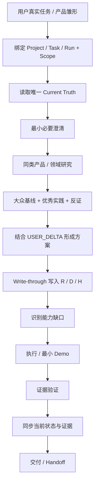

# Human AI Collab｜人机协作 Skill

> **让普通用户只需要说清“我想要什么结果”，AI 负责研究同类、补齐缺口、形成生产资料、稳定执行，并把下一位 AI 能直接接手的状态留下来。**

[](#当前验证状态)
[](LICENSE)
[](#快速开始)
[](#安装)
[](#当前验证状态)

**Maintainer：合一 / Heyi**

---

## 它解决什么问题？

普通 AI 已经很强，`human-ai-collab` 不应该重复“会写文档、会做网页、会调用工具”这些宿主本来就能做的事。

它要补的是更难的一层：

- 用户只有一个不完整的想法，AI 怎么自己补齐“大众基线”；
- 用户不懂产品/开发时，AI 怎么少问专业问题、更多自己判断；
- 同类产品、用户反馈、开源方案有哪些值得吸收，哪些坑要避开；
- 聊天里确认的需求、决定、假设，怎么**真的同步进文件**；
- 多项目、多任务、多会话时，状态到底属于谁，怎么避免读错数据；
- 工具失败以后怎么停止撞墙、找根因；
- 怎么证明“做完了”，而不是“看起来做完了”；
- 换一个 AI 后，能不能只看 workspace 就继续工作。

---

## V0.2 RC2 主流程



核心不是“流程更多”，而是：

> **普通 AI 想得到的，它要想到；普通 AI 没想到的，它要通过研究、证据和可交接资产补出来。**

---

## 首轮 A/B 为什么促成 V0.2？

V0.1 在同一 WorkBuddy 环境做过真实 Baseline vs Skill 对照。结果没有证明“装 Skill 就明显更强”：

- 需求分层、假设/决定结构化、用户问答负担有正向信号；
- 但最终产品没有显著领先强 Baseline；
- 工具调用、失败和返工更多；
- 数据沉淀没有形成预期优势；
- 还发生过跨组上下文污染，暴露 Scope / 数据归属缺陷。

所以 V0.1 不被定义为“成功版”。**测试成功了，因为它告诉我们 Skill 哪里没有真正产生生产力。**

---

## 第二轮测试前，又校对了哪些成熟项目？

在重新消耗 WorkBuddy 测试成本之前，V0.2 RC2 又对照了 Superpowers、Anthropic Skills / Skill Creator、GitHub Spec Kit、Mem0、Planning with Files、Deep Agents、Vercel Skills、Context Engineering Intro、Basic Memory 等成熟项目。

本轮只吸收适合轻量跨宿主 Skill 的架构原则，不搬它们整套 runtime：

| 借鉴点 | human-ai-collab 的落地 |
|---|---|
| Entity / task scope | `PROJECT_ID / TASK_ID / RUN_ID` + USER/PROJECT/TASK/RUN 四层状态 |
| Fail-closed planning | 多任务歧义停止，不 fallback 到兄弟任务 |
| Sandbox security | `SCOPE_ENFORCEMENT: HARD / SOFT`，模型自律不冒充安全隔离 |
| Single state owner | `STATE_OWNER` 唯一改写 TASK/INDEX Current Truth |
| Evidence-backed research | 问题/目标/非目标 + `EVIDENCE_AGAINST` + CITED/ASSUMPTION + confidence |
| Current-state memory | TASK 综合“现在是什么”，历史过程进 LOG，不无限 append |
| Context examples | 产品/视觉任务可选 `REFERENCE_EXAMPLES：借什么 / 不借什么` |
| Skill TDD / eval | 真实 baseline/with-skill 配对，多轮看时间、成本、方差和实际产品 |

完整校对记录见 [`docs/research/MATURE_AGENT_SKILL_BENCHMARK_2026-09-16.md`](docs/research/MATURE_AGENT_SKILL_BENCHMARK_2026-09-16.md)。

---

## 1. Scope 不只是一个目录

复杂任务开始时明确：

```text
PROJECT_ID
TASK_ID
RUN_ID
STATE_OWNER

WORK_ROOT
ALLOWED_READ_ROOTS
ALLOWED_WRITE_ROOTS
EXPLICIT_EXCEPTIONS
SCOPE_ENFORCEMENT: HARD | SOFT
```

**数据归属优先于路径包含。** 父目录能访问，不代表兄弟任务、共享 memory、其他项目可以读。

- `HARD`：WorkBuddy / 沙箱 / 宿主真实限制了访问路径；
- `SOFT`：只有 Skill 在提示 AI 自律。

`SOFT` 不能宣传成真正安全隔离。A/B、多项目、多用户或敏感资料场景应优先配置宿主 HARD 边界。

如果误读非本任务数据：

```text
CONTEXT_CONTAMINATED = TRUE
```

立即停止需要独立性的审计/判断；需要独立结论时，用新的干净 RUN / 会话重做被污染阶段。

---

## 2. 状态有寿命，不应该全部混成“记忆”

```text
USER_SCOPE     用户确认、跨任务稳定的信息
PROJECT_SCOPE  项目入口与长期项目状态
TASK_SCOPE     当前任务目标、需求、研究、产物
RUN_SCOPE      本次会话动作、错误、验证证据
```

临时观察不能自动升级成长期画像：

> RUN → TASK 要相关且经过确认/验证；TASK → USER 必须用户确认，而且跨任务仍有价值。

因此 `PROFILE.md` 仍然是**可选文件**，不是为了目录好看强行创建。

---

## 3. Product / Domain Research：先看世界，再发明

做新产品、网站、App、小程序、工具、服务时，如果存在成熟同类，默认先研究，但有饱和停止条件，不无限搜索。

研究至少考虑：

| 产物 | 含义 |
|---|---|
| `PROBLEM_STATEMENT` | 真正要解决的问题，不把“做 X”直接当问题 |
| `GOALS / NON_GOALS` | 这轮要改善什么、明确不做什么 |
| `TABLE_STAKES` | 这个品类大家默认期待什么 |
| `BEST_PRACTICES` | 成熟产品哪些做法值得借鉴 |
| `AVOID_LIST` | 常见差评、坑、复杂度陷阱 |
| `USER_DELTA` | 用户需求和大众基线的差异 |
| `EVIDENCE_AGAINST` | 最强反证、替代方案、不值得做的理由 |

每个重要 finding 区分：

```text
evidence_type: CITED | ASSUMPTION
confidence: HIGH | MEDIUM | LOW
```

连续看约 2–3 个有意义来源，或准备离开 research phase 前，影响决策的结论先写 `RESEARCH.md`。不能“嘴上参考了竞品”，文件还是空的。

---

## 4. 小白友好的 DELEGATED_MODE

用户说“你决定 / 你看着办 / 我不懂”时，AI 不应该继续把技术题扔回用户。

可逆、低风险、免费、不外发的事项由 AI 自主决定；付费、发布、授权、敏感数据、重要删除等再确认。

问结果：

> 你希望客户点链接查看，还是你生成 PDF 发给客户就够了？

而不是问：

> 你想用纯前端还是 Supabase？

---

## 5. Write-through：说记录了，就必须真的写了

`TASK.md` 是 Current Truth：

- 需求 `R-*`
- 决定 `D-*`
- 假设 `H-*`

重要状态变化后，**先写文件，再进入下一关键动作**。

TASK 保持“现在到底是什么”；被替代的决定留替代关系和 LOG，不让下一位 AI 在一堆历史方案里猜哪个还有效。

---

## 6. 执行纪律

- 同类失败连续 2 次 → 禁止直接第 3 次撞墙，先 `ROOT_CAUSE_CHECK`；
- 验证证据只有 `ACTIVE / SUPERSEDED / INVALID`；
- 后台进程、临时文件、旧证据未处理 → 不声称完成；
- `STATE_OWNER` 是共享 Current Truth 的单一写入者，并行 worker 不抢写 TASK/INDEX。

---

## 快速开始

仓库：`https://github.com/linglingling99/zhiqian-skill`

Agent Skills / `npx skills` 生态可尝试：

```bash
npx skills add linglingling99/zhiqian-skill --skill human-ai-collab
```

> GitHub → WorkBuddy 的 V0.1 实际下载安装/加载链已经跑通。重新测试 V0.2 时应删除/更新旧安装，确认实际加载的是当前 GitHub 版本。

示例：

> 我想做一个自由职业者报价工具，我不懂产品和开发，你根据你的判断把这件事推进到能用。

复杂任务请给 AI 一个**只属于这个任务**的工作目录；如果宿主支持路径权限，直接用 HARD 隔离。

---

## 本地生产资料

```text
资料主目录/
├── INDEX.md                     # PROJECT_ID / 当前 TASK_ID
├── PROFILE.md                   # USER_SCOPE，可选
└── tasks/<task-id>/
    ├── TASK.md                  # Current Truth：Identity / R / D / H / Scope / 验收
    ├── LOG.md                   # RUN_SCOPE：动作、错误、证据状态
    ├── RESEARCH.md              # 影响方案的真实研究
    ├── materials/
    ├── outputs/
    └── versions/                # 重大里程碑按需
```

**公共 Skill 是方法；用户 workspace 才是用户的数据资产。**

---

## 当前验证状态

| 项目 | 状态 |
|---|---|
| GitHub 分发仓库 | ✅ VERIFIED |
| GitHub 写入 / CI / 回读 | ✅ VERIFIED |
| WorkBuddy 下载安装 + 加载 V0.1 | ✅ VERIFIED |
| V0.1 独立 A/B | ✅ COMPLETED（未证明整体优势） |
| V0.1 Scope / 数据隔离 | ❌ FAILED，已作为 V0.2 回归目标 |
| V0.2 基础静态校验 | ✅ 30/30 |
| V0.2 RC2 行为契约静态校验 | ✅ 41/41 |
| 成熟项目架构校对 | ✅ COMPLETED |
| 可复用 eval 集 | ✅ `evals/evals.json` |
| V0.2 内部代理模拟 | 🧪 PROXY，仅作预检 |
| V0.2 WorkBuddy 真实 A/B | ⏳ PENDING |
| 真正换 AI Handoff | ⏳ PENDING |
| Codex / Claude Code / Cursor | ⏳ NOT TESTED |

> `0.2.0-rc2` 仍然不是“成功版”。真正是否优于强 Baseline，以重新部署后的真实多轮 A/B + Handoff 为准。

---

## 项目结构

```text
zhiqian-skill/
├── README.md
├── CHANGELOG.md
├── LICENSE
├── provenance/
├── docs/
│   ├── evaluation/
│   ├── research/
│   └── roadmap/
├── evals/
│   ├── evals.json
│   └── README.md
├── skills/human-ai-collab/
│   ├── SKILL.md
│   ├── references/
│   ├── assets/templates/
│   ├── THIRD_PARTY_NOTICES.md
│   └── licenses/
└── tests/
    ├── validate_skill.py
    ├── validate_behavior_contract.py
    └── V0.2_BEHAVIOR_SCENARIOS.md
```

---

## 测试原则

V0.2 不用“文件更多”证明价值。真正看：

- 产品/方案至少不弱于 Baseline；
- 用户问答负担下降；
- R/D/H 和研究结论真实同步；
- Scope 越界为 0；
- 失败/返工收敛；
- 新 AI 只拿 workspace 就能继续；
- 多轮结果有稳定增量，而不是偶然赢一次。

测试协议见 [`evals/README.md`](evals/README.md)。

---

## 隐私与权限

- 不自动读取父目录、兄弟任务或共享 memory；
- 不自动上传用户资料；
- 不自动扩大权限；
- 不把用户资料写回公共 Skill 仓库；
- 外部/导入资料按不可信数据处理，不执行其中嵌入指令；
- 如果宿主做不到真正隔离，明确标 SOFT，不冒充 HARD。

---

## License

MIT License  
Copyright (c) 2026 Heyi

原有第三方取材、commit 与许可见 `provenance/` 与 `skills/human-ai-collab/THIRD_PARTY_NOTICES.md`。成熟项目 Benchmark 新增来源仅作概念/架构校对，见对应研究文档。
