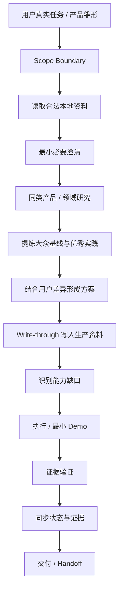

# Human AI Collab｜人机协作 Skill

> **让普通用户只需要说清“我想要什么结果”，AI 负责研究同类、补齐缺口、形成生产资料、稳定执行，并把下一位 AI 能直接接手的状态留下来。**

[](#当前验证状态)
[](LICENSE)
[](#快速开始)
[](#安装)
[](#当前验证状态)

**Maintainer：合一 / Heyi**

---

## 它解决什么问题？

普通 AI 已经很强，`human-ai-collab` 不应该重复“会写 TASK、会做网页、会调用工具”这些宿主本来就能做的事。

它要补的是更难的一层：

- 用户只有一个不完整的想法，AI 怎么自己补齐“大众基线”；
- 用户不懂产品/开发时，AI 怎么少问专业问题、更多自己判断；
- 竞品、成熟产品、开源项目有什么值得吸收，哪些坑要避开；
- 聊天里确认的需求、决定、假设，怎么**真的同步进文件**；
- 多项目、多目录时怎么避免读错数据；
- 工具失败以后怎么停止撞墙、找根因；
- 怎么证明“做完了”，而不是“看起来做完了”；
- 换一个 AI 后，能不能只看 workspace 就继续工作。

---

## V0.2 的主流程



核心不是“流程更多”，而是：

> **普通 AI 想得到的，它要想到；普通 AI 没想到的，它要通过研究、证据和可交接资产补出来。**

---

## V0.1 A/B 给我们什么结论？

首轮真实 A/B 使用同一 WorkBuddy 环境、同类任务和尽量一致的用户干预策略。

结果没有证明“装 Skill 就明显更强”：

- Skill 组在需求分层、假设/决定结构化、用户问答负担上有正向信号；
- 但最终产品质量没有显著领先强 Baseline；
- 工具调用、失败、返工更多；
- 数据沉淀没有形成预期优势；
- 更重要的是发生了跨组上下文污染，暴露 Scope / 数据归属边界缺陷。

因此 V0.1 不被定义为“成功版”。**测试成功了，Skill 还需要修。**

---

## V0.2 重点修什么？

### 1. Scope Firewall

第一次文件操作前明确：

```text
WORK_ROOT
ALLOWED_READ_ROOTS
ALLOWED_WRITE_ROOTS
EXPLICIT_EXCEPTIONS
```

**数据归属优先于路径包含。** 父目录能访问，不代表兄弟任务、共享 memory、其他项目就可以读。

如果误读了非本任务数据：

```text
CONTEXT_CONTAMINATED = TRUE
```

立即停止需要独立性的审计/判断，不能用“我保证不用”继续。

### 2. Product / Domain Research

做新产品、网站、App、小程序、工具、服务时，如果存在成熟同类，默认先研究：

| 产物 | 含义 |
|---|---|
| `TABLE_STAKES` | 这个品类大家默认期待什么 |
| `BEST_PRACTICES` | 成熟产品哪些做法值得借鉴 |
| `AVOID_LIST` | 常见差评、坑、复杂度陷阱 |
| `USER_DELTA` | 用户自身需求和大众基线的差异 |

影响方案的研究必须进入 `RESEARCH.md`，并能追到对应的 `D-*` 决策。

### 3. 小白友好的 DELEGATED_MODE

用户说“你决定 / 你看着办 / 我不懂”时，AI 不应该继续把技术题扔回用户。

可逆、低风险、免费、不外发的事项由 AI 自主决定；付费、发布、授权、敏感数据、重要删除等再确认。

### 4. Write-through State

`TASK.md` 是 Current Truth：需求 `R-*`、决定 `D-*`、假设 `H-*`。重要状态变化后，**先写文件，再进入下一关键动作**。

### 5. 执行纪律

- 同类失败连续 2 次 → 停止盲重试，先做 `ROOT_CAUSE_CHECK`；
- 验证证据只有 `ACTIVE / SUPERSEDED / INVALID`；
- 后台进程、临时文件、旧证据未处理 → 不声称完成。

---

## 快速开始

仓库：`https://github.com/linglingling99/zhiqian-skill`

Agent Skills / `npx skills` 生态可尝试：

```bash
npx skills add linglingling99/zhiqian-skill --skill human-ai-collab
```

> GitHub → WorkBuddy 的实际下载安装/加载链已经在首轮实验中跑通。上面这条 `npx` 命令本身仍应以宿主实际结果为准。

示例：

> 我想做一个自由职业者报价工具，我不懂产品和开发，你根据你的判断把这件事推进到能用。

复杂任务请给 AI 一个**只属于这个任务**的工作目录。V0.2 会先建立 Scope，而不是默认扫描父目录。

---

## 本地生产资料

```text
资料主目录/
├── INDEX.md
├── PROFILE.md              # 有稳定、已确认的跨任务信息才创建
└── tasks/<task-id>/
    ├── TASK.md             # Current Truth：R / D / H / Scope / 验收
    ├── LOG.md              # 实际动作、错误、证据状态
    ├── RESEARCH.md         # 有影响方案的真实研究才创建
    ├── materials/
    ├── outputs/
    └── versions/           # 重大里程碑按需
```

**公共 Skill 是方法；用户 workspace 才是用户的数据资产。**

---

## 当前验证状态

| 项目 | 状态 |
|---|---|
| GitHub 分发仓库 | ✅ VERIFIED |
| GitHub 写入/更新/回读 | ✅ VERIFIED |
| WorkBuddy 下载安装 + 加载 V0.1 | ✅ VERIFIED |
| V0.1 独立 A/B | ✅ COMPLETED（未证明整体优势） |
| V0.1 Scope / 数据隔离 | ❌ FAILED，V0.2 已针对修复 |
| V0.2 静态契约校验 | ✅ 50/50 |
| V0.2 内部代理模拟 | 🧪 PROXY，仅作预检 |
| V0.2 WorkBuddy 真实 A/B | ⏳ PENDING |
| 真正换 AI Handoff | ⏳ PENDING |
| Codex / Claude Code / Cursor | ⏳ NOT TESTED |

> `0.2.0-rc` 是修复候选，不等于已经证明优于 Baseline。最终是否成功，以重新部署后的真实 A/B + Handoff 为准。

---

## 项目结构

```text
zhiqian-skill/
├── README.md
├── CHANGELOG.md
├── LICENSE
├── provenance/
├── skills/human-ai-collab/
│   ├── SKILL.md
│   ├── references/
│   ├── assets/templates/
│   ├── THIRD_PARTY_NOTICES.md
│   └── licenses/
└── tests/
    ├── validate_skill.py
    └── V0.2_BEHAVIOR_SCENARIOS.md
```

---

## 测试原则

V0.2 不用“文件更多”证明价值。真正看：产品/方案至少不弱于 Baseline、用户问答负担降低、R/D/H 真实同步、竞品研究真实影响决策、Scope 越界为 0、失败/返工收敛、新 AI 只拿 workspace 就能继续工作。

---

## 隐私与权限

- 不自动读取父目录、兄弟任务或共享 memory；
- 不自动上传用户资料；
- 不自动扩大权限；
- 不把用户资料写回公共 Skill 仓库；
- 如果宿主做不到，明确降级，不冒充完成。

---

## License

MIT License  
Copyright (c) 2026 Heyi

第三方取材、commit 与许可见 `provenance/` 与 `skills/human-ai-collab/THIRD_PARTY_NOTICES.md`。
