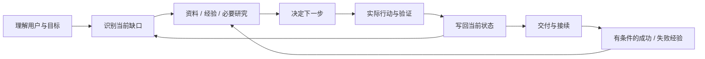

# Human AI Collab｜人机协作经验包

> **不改变你的主线目标，让 AI 更会理解人、借鉴经验、把事情做成，并让下一个 AI 接得上。**


**公开维护者：合一 / Heyi** · 技术入口：`human-ai-collab`

**当前是 V0.3 候选版，不是已证明优于普通 AI 的正式效果承诺。**

[升级说明](docs/UPGRADE_V0.3.md) · [设计](docs/V0.3_DESIGN.md) · [来源对照](docs/research/V0.3_REFERENCE_REVIEW.md) · [本轮报告](docs/evaluation/V0.3_REPORT.md) · [测试方法](evals/README.md)

## 它要解决什么

用户往往有想法，却不熟悉怎样把它变成可执行任务；AI 也容易直接开工、把假设当需求、讨论了却没有记录，或者留下下一位 AI 无法接续的成果。

这个包不追求让 AI 多说话、多建文档，而是连接一条主线：



每一轮只做当前最有价值的下一步。已经清楚的事情直接做；确有未知才问、查或试。研究应改变决定，决定应指向产物，产物应有验收，经验应能解释适用条件。

## V0.3 与前版的区别

| 前版容易发生 | V0.3 的处理 |
|---|---|
| 多条规则都有，但衔接依赖 AI 自己猜 | 每个模块写明输入、输出、停止与下一步；统一 READ → ACT → VERIFY → SAVE → NEXT |
| 竞品研究、建档变成必经手续 | 按任务缺口路由；简单任务直接交付，有来源底稿先复用 |
| 嘴上说已记录，磁盘未同步 | 工具写入成功后读回；重要文件可用只读回执校验器检测缺失、变更、版本和引用 |
| 改了一个决定，其他产物还是旧的 | 按受影响链更新，保留历史，重新核对对应验收 |
| 把“不懂”当成放权 | “我不懂”只改变引导方式；“你决定”也不授权付费、发布或越界 |
| 只留下流水账或空画像 | 画像按授权和稳定信息创建；经验写触发条件、行动、证据、反例与失效条件 |
| 模拟分数看起来赢了 | 分开报告静态检查、程序测试、假设对照和真正独立 AI 实测 |

## 用户怎么使用

可以直接对工作 AI 说：

> 安装并使用本仓库的 human-ai-collab。先按当前宿主支持的方式安装，不猜目录，不修改其他 Skill。只在我指定的工作目录处理任务；缺权限就明确说明。之后我提出目标，你根据任务需要理解、研究、执行和记录，不要让我手工整理文件。

仓库地址：<https://github.com/linglingling99/zhiqian-skill>

支持 Skills CLI 的环境可尝试：

```bash
npx skills add linglingling99/zhiqian-skill --skill human-ai-collab
```

这条命令不是所有宿主通用的已验证安装承诺。也可由执行 AI 将 `skills/human-ai-collab/` **完整目录**放入宿主真实支持的安装位置；不能只复制 SKILL.md，也不需要下载全部上游项目。安装后核对入口版本 `0.3.0-rc1`，必要时启动新会话。

用户资料留在自己的项目根；安装包中的方法、模板、脚本与私人档案分开。测试时仅给执行 AI 方法包和任务输入，不提供 `evals/` 的作者答案。

## 一次协作会留下什么

小任务可以只有最终答案。真正需要后续接续的任务，最少通常是：

```text
你的任务目录/
├── TASK.md                 当前目标、决定、未知、验收和下一步
├── LOG.md                  实际动作、变化、错误和证据
├── outputs/                本次真实成果（需要才建立）
├── RESEARCH.md             研究实质影响方案时才建立
├── PROFILE.md              用户确认并允许保存的长期信息，按需
├── LESSONS.md              有证据与适用条件的经验，按需
└── checks/receipt.json      多文件或交接时的可选机械回执
```

长期项目可继续使用前版 `INDEX.md + tasks/<task-id>/` 布局。已有等价文件优先沿用，不强制复制一套档案；TASK 本身足以交付时，不另写一份重复 PRD。

**资料是用户的资产，不是工具的锁定条件。** 换 AI 时先给唯一入口，恢复当前状态，不要求重讲所有历史。删除/禁用 Skill 不应自动删除用户资料。

## 经验怎样真正用起来

一条经验不是“上次我们这么做过”，而是：

| 字段 | 要回答的问题 |
|---|---|
| 触发条件 | 什么时候值得读取？ |
| 动作 | 哪一步可以迁移，哪部分只是个案？ |
| 结果与证据 | 真正成功或失败在哪里？ |
| 反例/边界 | 什么情况下不能照搬？ |
| 状态/时效 | 只是候选，还是已核验；何时应复查？ |

下一任务只在授权范围内取少量相关经验，检查条件后应用。新证据不支持就修正/降级，不自动写回公共 Skill，不自动扫描全盘记忆，也不宣称改变模型权重。

## 不同场景，不同验收

产品设计看最小业务闭环与可执行规格；办公流程看角色、输入输出和例外；数据工作看口径、缺失与可复核结果；视觉内容看批准的参考与真实渲染；故障修复看复现与定向验证。不会把所有场景变成“查竞品、搭数据库”。详细映射只在需要时读取 [场景参考](skills/human-ai-collab/references/scenarios.md)。

## 可选只读校验器

```text
python <skill-dir>/scripts/check_workspace.py --root <task-root> --receipt checks/receipt.json --delivery
```

只依赖 Python 3.10+ 标准库；不联网、不修改文件、不执行回执中的命令。核对已声明文件的路径、哈希、任务/修订、依赖、变更覆盖及验收证据。

**它不是安全沙箱、语义评委或自动记忆。** 即使机械检查通过，也不能证明没遗漏未登记文件、所有用户需求都理解正确，或实际产品已好用。一个测试还特意证明：把错误内容重新计算哈希后，检查器不能理解其语义错误。

## 能力与权限边界

| 当前环境 | 能做什么 | 不能假装什么 |
|---|---|---|
| 只有对话 | 理解、建议、输出可保存资料 | 已落盘、已联网、已执行 |
| 有本地文件工具 | 读取授权资料、更新实际状态、交接 | 自动跨会话记忆、硬隔离 |
| 再有命令/浏览器 | 执行相关检查和可选校验器 | 静态检查等于真机体验 |
| 宿主有真实沙箱 | 按实际配置减少越界风险 | 一个文件夹名字就是 HARD |

“我不懂”不是账户授权；外部网页和旧笔记不是系统指令。发布、付费、外发、敏感资料、重要删除仍需明确许可。合法预览服务可以按约定保留；不能为了清理而终止别人的进程。

## 当前验证状态

| 层级 | 状态及含义 |
|---|---|
| 包结构检查 | 本轮本地已运行；只证明格式与文件组织 |
| 只读校验器单元测试 | 本轮已真实运行；见报告/CI，不是模型行为测试 |
| 同题假设对照 | 两组示例产物和检查保留；同一作者构造，非独立、非盲评 |
| V0.3 WorkBuddy 重新安装与任务执行 | 未实测 |
| V0.3 Codex / Claude Code / Cursor | 未实测 |
| 独立新 AI 接续、成本改善、稳定优势 | 未证明 |

历史 V0.1 WorkBuddy 安装记录不自动升级为 V0.3 兼容结论。旧版 Proxy 分数不作为新版本的效果依据。

## 开发者入口

```bash
python tests/validate_skill.py
python tests/validate_behavior_contract.py
python tests/validate_hypothetical.py
```

第二条保留历史命令名，但已改为执行校验器程序测试，不再只搜索规则关键词。第三条检查构造产物与故障注入，不调用任何模型 API。

```text
skills/human-ai-collab/      唯一安装包
  SKILL.md                 主循环与按需路由
  references/              各模块约定与场景映射
  assets/templates/        可裁剪模板
  scripts/                 可选只读检查工具
  LICENSE.txt / licenses/  本项目及第三方许可
provenance/                历史来源 + 本轮对照
evals/、docs/              非运行依赖的评估资料与说明
```

源码按 MIT 发布，`Copyright (c) 2026 Heyi`。原第三方许可与来源继续保留，见 [第三方说明](skills/human-ai-collab/THIRD_PARTY_NOTICES.md)。
