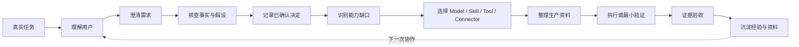
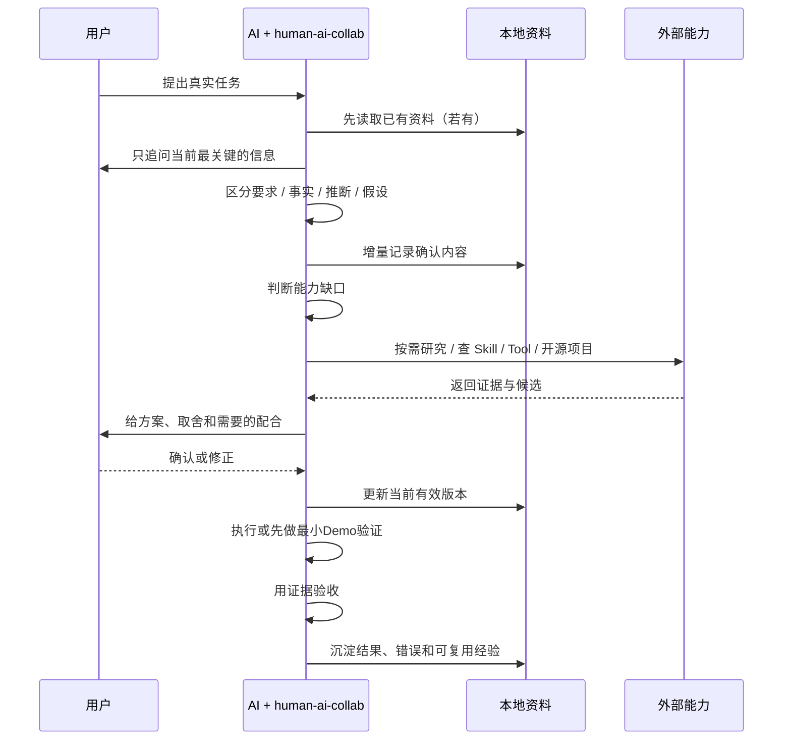

# Human AI Collab｜人机协作 Skill

> **让 AI 在动手之前先理解你、理解任务，并把每一次协作变成可以继续使用的生产资料。**

[](#当前状态)
[](LICENSE)
[](#快速开始)
[](#安装)
[](#当前状态)

**Maintainer：合一 / Heyi**

---

## 它解决什么问题？

很多 AI 协作失败，不是因为模型不够强，而是因为：

- AI **不了解用户**，却直接开始做；
- 用户只有一个模糊想法，AI却把它当成完整需求；
- 用户的假设可能不成立，AI仍然一路迎合；
- 已经确认的决定没有留下来，下一轮又从头解释；
- 需要什么模型、Skill、Tool、Connector、资料和权限，没有先梳理；
- AI说“完成了”，但没有真实证据证明结果可用。

`human-ai-collab` 尝试把这条链路改成：



它不是为了让流程变多，而是为了**减少误解、跑偏和返工，让 AI 与人的合作能够积累。**

---

## 使用前后，有什么不同？

| 普通的一次性对话 | 使用 Human AI Collab |
|---|---|
| 用户说一句，AI马上开干 | 先判断是否真的需要澄清 |
| 模糊想法直接变成实现方案 | 把目标、范围、约束和验收捋清 |
| 用户说“可以”就当事实成立 | 区分偏好、要求、事实、推断和假设 |
| AI只顺着用户说 | 有依据地提出异议，并给最小验证办法 |
| 每轮重新解释背景 | 重要状态写入用户自己的本地资料 |
| 上来就找工具/换模型 | 先确认能力缺口，再决定是否需要外部能力 |
| “看起来完成了” | 用当次证据验收 |
| 任务结束，对话价值消失 | 结果、决定、经验沉淀为可迁移数据资产 |

---

## 核心价值

### 1. AI 逐渐了解“怎么和你合作”

它不会把一次聊天推断成永久人格标签。

它只记录与协作有关、经过确认的信息，例如：

- 你的工作背景与已有能力；
- 你习惯怎样理解问题；
- 哪些专业环节你熟悉，哪些需要 AI 补足；
- 你偏好的表达与决策方式；
- 当前任务真正的目标与限制。

AI 的观察与推断必须标注为**待确认**，不能悄悄升级成“事实”。

### 2. 帮你把“想法”变成“可执行需求”

用户能提出需求，不代表需求里的每个前提都成立。

本 Skill 要求 AI：

> **尊重目标与偏好，但对事实、方案与可行性保持验证意识。**

如果十个想法只有两个当前可行，AI应该指出：

- 哪个前提存在问题；
- 依据是什么；
- 哪些只是未知而不是“不行”；
- 最低成本怎样验证；
- 有什么替代路径。

这不是反驳用户，而是共同完善判断模型。

### 3. 把对话变成可迁移的本地生产资料

重要信息不只存在聊天上下文里，而是进入用户自己的工作目录。

```text
你的资料主目录/
├── INDEX.md              # 总入口：当前任务在哪里
├── PROFILE.md            # 协作背景、偏好、待确认观察
└── tasks/
    └── <task-id>/
        ├── TASK.md       # 当前有效需求、决定、执行准备、验收
        ├── LOG.md        # 真实动作、变更、错误、恢复点
        ├── RESEARCH.md   # 有真实研究才创建
        ├── materials/    # 用户资料 / 获准来源
        ├── outputs/      # 实际成果
        └── versions/     # 关键里程碑快照
```

> **公共 Skill 是方法；用户目录才是用户自己的数据资产。**

即使以后换模型、换 AI、换工作台，资料仍然可以继续交接和读取。

### 4. 先知道缺什么，再找能力

只有当当前任务出现明确缺口时，才考虑：

- **Model**：当前模型能力够不够？是否真的需要换；
- **Skill**：有没有成熟方法可复用；
- **Tool**：是否需要具体操作工具；
- **Connector / MCP**：是否需要访问外部应用或数据；
- **Open Source**：有没有成熟开源项目可学习或复用；
- **Data**：还缺什么数据或资料；
- **Permission**：需要读、写、上传、发布到什么范围。

搜索、推荐、安装、授权是不同阶段。

**热度是参考，不是安全许可；用户批准也不等于技术事实已经成立。**

---

## 什么时候应该触发？

### 推荐使用

- 任务比较模糊，用户自己也没完全想清楚；
- 新项目、新产品、新工作流；
- 跨领域协作；
- 返工成本比较高；
- 需要查资料、找开源项目或 Skill；
- 需要跨会话或换 AI 接续；
- 用户明确说“先别急着做，先把事情想清楚”。

### 不需要启动完整流程

- 简单事实问答；
- 明确的一次性小修改；
- 快速查证；
- 不需要保存上下文的临时任务。

**轻量化不是少思考，而是只在真正需要时增加步骤。**

---

## 信息不会混在一起

| 类型 | 示例 | AI 应该怎样处理 |
|---|---|---|
| 用户偏好 | “我喜欢黑色背景” | 尊重，不做真假判断 |
| 用户要求 | “这版不要支付功能” | 写入当前需求 |
| 用户自述事实 | “这个接口支持实时数据” | 必要时核查 |
| 已核对事实 | 官方文档明确支持 | 作为依据 |
| AI 推断 | “你可能更适合先做Demo” | 标记推断，等待确认 |
| 待验证假设 | “这个开源项目能直接复用” | 给出最小验证办法 |
| 已确认决策 | “首版只做展示型网页” | 记录并保护，变更要留痕 |

---

## 快速开始

### 1. 安装 Skill

仓库：

`https://github.com/linglingling99/zhiqian-skill`

Agent Skills / `npx skills` 生态的安装命令形态：

```bash
npx skills add linglingling99/zhiqian-skill --skill human-ai-collab
```

> **当前状态：此命令尚未在真实宿主完成安装验证。**  
> GitHub 上传完成后，会在独立环境测试 Codex / WorkBuddy / Claude Code / Cursor 等实际表现。

如果宿主采用手动 Skill 目录，也可以复制：

```text
skills/human-ai-collab/
```

到对应宿主的 Skill 目录。

### 2. 选择自己的资料目录

首次使用时，告诉 AI 你希望把协作资料保存在哪里。

Skill **不硬编码默认目录**，也不会把用户资料写进公共 Skill 安装目录。

### 3. 直接说一个真实任务

例如：

> 我想做一个自己的会员网站，但我不懂开发。

或者：

> 我有一个工作台的想法，你先别急着写代码，帮我把需求和实现路径捋清楚。

不需要先填40道问卷，也不需要先理解内部文件结构。

---

## 一次真实协作会发生什么？



---

## 生产资料就绪之后，AI才进入执行

复杂任务进入真正执行前，至少应该能回答：

| 要素 | 要知道什么 |
|---|---|
| 目标 | 最终希望得到什么 |
| 范围 | 这次做什么、不做什么 |
| 用户/业务 | 给谁用、解决什么 |
| 资料 | 已有什么、缺什么 |
| 决策 | 哪些已经确认 |
| 能力 | Model / Skill / Tool / Connector 是否足够 |
| 数据 | 从哪里来、是否可靠 |
| 权限 | AI允许读、写、上传、发布到哪里 |
| 风险 | 哪些前提仍需要验证 |
| 验收 | 怎样证明“做完了” |

不要求所有事情一次性完美。

如果某个关键假设不确定，可以先做**最小Demo / Spike**验证，再决定是否进入完整生产。

---

## 安装成功后如何判断

装完 ≠ 生效。可以用这四点判断：

1. **宿主能识别 `human-ai-collab`**；
2. 给一个模糊任务时，它不会不经思考直接开始大规模执行；
3. 指定资料目录后，它能读取/创建协作文档；
4. 没有写文件、联网或安装权限时，它会明确说明能力边界，而不是假装做过。

任何一项没有实际证据，都不要标成 VERIFIED。

---

## 当前状态

> `v0.1.0` 是候选版本，**已经完成结构与静态检查，但尚未证明行为有效。**

| 项目 | 状态 |
|---|---|
| GitHub-ready 结构 | ✅ READY |
| 静态校验 | ✅ 30/30 |
| 解压后复验 | ✅ 30/30 |
| Codex 实际加载 | ⏳ NOT TESTED |
| WorkBuddy 实际加载 | ⏳ NOT TESTED |
| Claude Code 实际加载 | ⏳ NOT TESTED |
| Cursor 实际加载 | ⏳ NOT TESTED |
| 跨会话 / 换 AI 接续 | ⏳ NOT TESTED |
| GitHub安装命令 | ⏳ NOT TESTED |
| 独立 A/B 行为对照 | ⏳ NOT TESTED |

下一阶段不是继续堆功能，而是：

```text
GitHub 分发 → 陌生环境安装 → 同题 A/B → 保留证据 → 迭代 V0.2
```

---

## 项目结构

```text
zhiqian-skill/
├── README.md
├── CHANGELOG.md
├── LICENSE
├── provenance/
│   ├── REUSE_MAP.md
│   ├── sources.lock.json
│   └── licenses/
├── skills/
│   └── human-ai-collab/
│       ├── SKILL.md
│       ├── THIRD_PARTY_NOTICES.md
│       ├── licenses/
│       ├── references/
│       │   ├── dialogue.md
│       │   ├── memory.md
│       │   ├── research.md
│       │   └── delivery.md
│       └── assets/
│           └── templates/
│               ├── index.md
│               ├── profile.md
│               ├── task.md
│               ├── research.md
│               └── log.md
└── tests/
    └── validate_skill.py
```

运行入口只有：

```text
skills/human-ai-collab/SKILL.md
```

`references/` 按需读取，不要求一次把全部内容塞进上下文。

---

## 开源能力来源

这个项目不是从零重复造轮子，而是对成熟开源机制进行**选择性取材、去平台绑定、去冲突、重新组织**。

| 来源 | 借鉴能力 | 许可 |
|---|---|---|
| [obra/superpowers](https://github.com/obra/superpowers) | 需求澄清、方案确认、证据验收 | MIT |
| [OthmanAdi/planning-with-files](https://github.com/OthmanAdi/planning-with-files) | 文件化工作记忆、任务接续 | MIT |
| [vercel-labs/skills](https://github.com/vercel-labs/skills) | 按能力缺口发现 Skill | MIT |
| [anthropics/skills](https://github.com/anthropics/skills) | Skill 创建与评估方法参考 | Apache-2.0 |

具体 commit、源文件 SHA-256、取材去向、删除了什么以及为什么删除，见：

- [`provenance/REUSE_MAP.md`](provenance/REUSE_MAP.md)
- [`provenance/sources.lock.json`](provenance/sources.lock.json)
- [`skills/human-ai-collab/THIRD_PARTY_NOTICES.md`](skills/human-ai-collab/THIRD_PARTY_NOTICES.md)

---

## 隐私与权限

- 公共 Skill 只存方法、规则、模板；
- 用户数据只存用户自己的工作目录；
- 不自动上传用户资料；
- 不自动安装未知 Skill；
- 不默认扩大权限；
- 付费、上传、发布、安装、修改重要数据等行为，必须遵守宿主实际授权；
- 无网络时不声称“已经搜索”；
- 无文件权限时不声称“已经保存”；
- 本地资料可迁移，不等于任何平台会自动读取。

---

## 卸载 / 停止使用

按宿主正常方式禁用或删除 Skill 即可。

> 删除 Skill **不会删除用户自己的资料目录**。  
> 方法与用户数据物理分离，是这个项目的基本设计之一。

---

## 开发者校验

静态检查：

```bash
python3 tests/validate_skill.py
```

它检查：

- frontmatter；
- Skill name 与目录；
- references / templates 断链；
- License / THIRD_PARTY_NOTICES；
- 本机绝对路径残留；
- API Key / Token / 密码模式；
- 缓存文件；
- 测试答案文件混入；
- provenance / sources.lock.json。

> 静态校验通过 **不等于** Skill 行为有效。行为有效性需要独立环境与 A/B 测试。

---

## Roadmap

- [x] V0.1 需求与方法设计
- [x] 开源来源取材与许可记录
- [x] Skill / references / templates 组装
- [x] 静态校验与交付包复验
- [ ] GitHub分发后实际安装测试
- [ ] Codex / WorkBuddy / Claude Code / Cursor兼容测试
- [ ] 新手 vs 重度AI用户体验测试
- [ ] 有 Skill / 无 Skill 同题 A/B
- [ ] 跨会话 / 换 AI 接续验证
- [ ] 根据真实证据迭代 V0.2

---

## License

本项目自身内容采用 [MIT License](LICENSE)。

```text
Copyright (c) 2026 Heyi
```

第三方来源与许可声明见 [`THIRD_PARTY_NOTICES.md`](skills/human-ai-collab/THIRD_PARTY_NOTICES.md)。

---

## Maintainer

**合一 / Heyi**

> 这不是“让AI多走流程”的工具。  
> 它试图解决的是：**让人与AI在真正开始工作之前先形成足够的共同理解，并让每次合作留下下一次还能继续使用的东西。**
